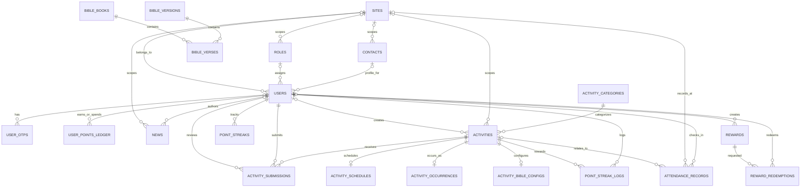

# Project Analysis

**Scope:** source, migrations, configuration, scripts, CI, and checked-in documentation in this repository. This document does not change application behavior.

**Evidence labels:** **Verified** means directly present in source, migrations, or configuration. **Inferred** means strongly implied by multiple implementation details. **Unknown / Requires Confirmation** means the repository does not establish the intended behavior.

## 1. Project Overview

**Verified:** ChristAPI is a Go REST API built with Fiber v2 and PostgreSQL. Its source is organized as feature packages under `internal/`, shared packages under `pkg/`, route registration in `routes/`, and separate server and seeder entrypoints under `cmd/`. PostgreSQL access uses `database/sql` with the pgx stdlib driver and hand-written SQL; there is no ORM.

The API supports account registration and approval, member profiles and contacts, sites and roles, activities and Bible reading submissions, attendance, points and rewards, news, and Bible text lookup. API routes are registered under `/api` (not `/api/v1`). There is no frontend application source directory. The HTML files under `docs/` are demos, not an application UI.

## 2. Project Purpose

**Inferred:** The product supports church or congregation operations: user onboarding and approval, church/site membership, activities and attendance, Bible reading/reflection, points and reward redemption, news, and contact/profile management. The names and role labels (including `Jemaat`) and Indonesian Bible dataset support this interpretation.

**Verified intended actors:** unauthenticated registrants and Google-authenticated registrants; approved authenticated users; and users assigned the `admin` or `super_admin` role code. Other role codes are stored and manageable, but the implementation does not define a general permission matrix.

**Unknown / Requires Confirmation:** whether a site is a tenant/security boundary, who may assign sites, whether activity registration is intended to be enforced, and the product's production/deployment model. Member draft visibility is confirmed admin-only.

## 3. Technology Stack

| Area | Technology and use |
|---|---|
| Language/runtime | Go 1.25 module (`go.mod`). |
| HTTP | Fiber v2 for routing, middleware, JSON parsing, CORS, static serving, and multipart uploads. |
| Database | PostgreSQL; `database/sql` plus `github.com/jackc/pgx/v5/stdlib`; SQL migrations are run with the `migrate/migrate` container or CLI. |
| Authentication | JWT v5, signed with HS256; bcrypt password hashing via `golang.org/x/crypto`; Google ID-token validation via `google.golang.org/api/idtoken`. |
| Email | SMTP delivery through `gomail` for OTP messages. |
| Configuration | Environment variables; `godotenv` attempts `.env.local`, then `.env`. Docker Compose separately loads `.env.docker`. |
| Static/file storage | Local `docs/` and `uploads/` directories served by Fiber; image files are written under `uploads/{activities,news,rewards,profiles}`. |
| Build/deployment | Multi-stage Alpine Dockerfile; Docker Compose services for API, PostgreSQL, and a migration runner. Bash and PowerShell setup scripts are provided. |
| CI | GitHub Actions installs Go 1.25, downloads modules, runs `go test ./...`, `go vet ./...`, checks `gofmt`, and builds all packages. It does not start PostgreSQL. |
| Tests/load tools | Unit tests cover rate limiting, Google identity claim/subject checks, attendance date parsing, image content validation, and sanitized error responses. PostgreSQL integration tests are not present. The k6 endpoint script is tracked. |

No frontend framework, ORM, cache, queue, background-job framework, event bus, or deployment platform is evidenced. Apart from Google identity verification and SMTP, no external runtime integrations are apparent.

## 4. Repository Structure

- `cmd/server/`: API process entrypoint; loads configuration, checks `JWT_SECRET`, connects PostgreSQL, configures Fiber/CORS/middleware/static paths, then registers routes.
- `cmd/seeder/`: standalone Bible CSV seeder; it does not create an administrator despite commented-out historical code.
- `internal/`: domain modules. Most have model, repository, service, and handler files; this is a convention, not a strict uniform layering contract.
- `internal/auth/dto/`: auth request/response types; `internal/auth/helpers/`: password, OTP, and request validation helpers.
- `internal/middleware/`: JWT authentication, admin role check, request logging, and in-memory rate limiter.
- `internal/email/`: OTP email delivery.
- `internal/uploadimage/`: shared extension, size, and detected content-type validation for uploaded images.
- `pkg/database/`: PostgreSQL connection creation and process-global `database.DB`.
- `pkg/jwt/`: JWT secret access and token generation.
- `pkg/response/`: shared JSON response helpers.
- `routes/`: endpoint registration and handler/repository construction.
- `migrations/`: numbered up/down SQL migrations, currently through migration 21; migration 14 down drops attendance data, and migration 21 adds nullable FKs as `NOT VALID`.
- `docs/`: SQL snapshot, Postman collection, HTML demos, and Indonesian Bible CSV data.
- `uploads/`: local media directory served as static content; files present in this workspace are not tracked in Git.
- Root scripts/configuration: Docker, Compose, setup/reset helpers, Makefile, env examples, CI, and developer guides.

## 5. Application Architecture

**Verified:** `cmd/server/main.go` connects infrastructure and applies Fiber middleware. `routes.Setup` constructs repositories with the global `database.DB`, constructs handlers, groups routes under `/api`, and attaches middleware to route groups. Handler constructors commonly construct their own concrete service, and services hold concrete repository pointers. The current implementation does not generally use repository interfaces or a dependency-injection container.

The common feature path is:

```text
Fiber route and middleware
  -> feature handler (parse/validate request and map response)
  -> service (business checks; sometimes a thin pass-through)
  -> repository (parameterized SQL using database/sql)
  -> PostgreSQL
  -> pkg/response JSON envelope
```

This is not universal: `activitysubmissions` handlers work directly with a repository; some services add little beyond forwarding; shared DB access is process-global. Follow the pattern of the specific neighboring feature rather than assuming every layer is mandatory.

## 6. Request / Data Flow

1. The server loads `.env.local` or `.env`; missing files are tolerated if variables are supplied by the process environment. Startup fails if `JWT_SECRET` is empty or PostgreSQL cannot be reached.
2. CORS allows `CORS_ORIGINS`, defaulting to localhost ports 3000 and 3001. The custom logger and in-memory rate limiter are installed globally.
3. `/docs` and `/uploads` are served statically. `routes.Setup` registers unversioned `/api/...` routes.
4. Public routes include login, registration, OTP, Google auth, and Bible reads. Most member/admin business routes are in a group protected by `AuthMiddleware`; `/api/admin/...` additionally uses `AdminOnly`.
5. `AuthMiddleware` parses an HS256 JWT, requires `user_id` and `iat`, then checks current active/approval state, logout timestamp, and `role_id` in PostgreSQL. It stores user/role IDs in Fiber locals.
6. `AdminOnly` resolves the current role code for that live `role_id` and allows only `admin` or `super_admin`. Role changes apply on the next request, even for an unexpired JWT.
7. Handlers parse JSON, form, or multipart data and call services/repositories. SQL writes that span related records/point balances use transactions in selected flows.
8. Success/error helpers return JSON with `success`, `message`, and optionally `data`, `errors`, or `meta`. The rate-limit response is a separate, smaller shape.

## 7. Database Architecture

**Verified:** PostgreSQL is the only database engine configured. The connection is opened through pgx and `database/sql`; pool settings are 25 max open connections, 10 idle connections, and a five-minute connection lifetime. Query parameters use PostgreSQL `$n` placeholders. No ORM/schema auto-migration runs at API startup.

The migration history is the best description of the application schema. Important tables and constraints include:

| Table(s) | Purpose and notable fields/constraints |
|---|---|
| `users` | Accounts; email is unique; includes password hash (nullable after auth overhaul), username, Google ID, auth provider, approval status, active flag, role/contact/site IDs, point balance, login/logout timestamps. Migration 21 adds nullable FKs to contacts, roles, and sites as `NOT VALID`. Status/provider have no check constraints. |
| `user_otps` | OTP code and expiry associated with a user; user deletion cascades. |
| `roles` | Name, unique non-null code, description, optional site ID. Seeded role codes include `super_admin`, `admin`, `church_staff`, and `public`; migration 19 changes the public role's display name to `Jemaat`, not its code. |
| `contacts` | Name, phone, address, site ID, soft-delete timestamp, and profile-photo URL. `users.contact_id` references contacts; `contacts.site_id` references sites through migration 21 (`NOT VALID`, `ON DELETE SET NULL`). |
| `sites` | UUID, name, address, timestamps. Migration 21 adds nullable FKs for user/contact/role/news site IDs. Existing rows are not validated until orphan cleanup and explicit validation. |
| `news` | Title/slug/content, author/site IDs, draft status, featured flag, JSONB metadata, publish/view fields, image URL, soft-delete timestamp. Migration 21 adds nullable FKs for author/site; a unique `(site_id, slug)` index exists only in the legacy snapshot, not migration 1. |
| `user_points_ledger` | Point delta, resulting balance, reason, optional reference and timestamp; user FK cascades on delete; indexes by user and creation time. Current balance is also stored on `users`. |
| `activity_categories`, `activities` | Category code unique; activity UUID unique; activity/category/type/status, site/creator, capacity/registration, image and streak settings. Activity type/status are constrained; activity references category and optional site/creator. Categories are seeded in migration 7. |
| `activity_schedules`, `activity_occurrences` | Optional one-to-one schedule or occurrence per activity (`activity_id` is unique); frequency, interval, date/time/time zone or start/end/location/status fields. Both cascade when activity is deleted. |
| `activity_bible_configs`, `activity_submissions` | One Bible config per activity; submissions reference activity/user, hold answer and review state/note/reviewer/timestamps, unique once per `(activity_id,user_id)`. User/activity deletion cascades. |
| `bible_versions`, `bible_books`, `bible_verses` | Version and book codes are unique; book order is unique; testament is `PL` or `PB`; verse position is unique per version/book/chapter/verse. Verses cascade with version/book. Full-text GIN index is declared. |
| `attendance_records` | User/site/activity, UTC attendance date, check-in time, status, points and notes; unique per `(user_id, attendance_date)`; user deletion cascades. Status is constrained to present/late/absent/excused. |
| `point_streaks`, `point_streak_logs` | Current/longest streak and activity logs; unique per user/type; after migration 10, logs allow distinct activities on the same user/type/date. User/activity deletions cascade. |
| `rewards`, `reward_redemptions` | Reward cost/stock/status and redemption state/codes/notes/timestamps. Checks require positive cost and nonnegative stock; redemption status is constrained; one pending redemption per user/reward via partial unique index. User deletion cascades for redemptions. |

**Schema source caveat:** `docs/schema.sql` is a PostgreSQL 14 dump of an older schema. It contains legacy Bible tables (`surat`, `pasal`, `ayat`, and `perikop`) and does not include the current auth-overhaul, activities, Bible API, attendance, reward, or activity-submission schema as represented by migrations. It also declares some legacy user/contact/site/role constraints not present in the migration chain. The setup guide's manual instruction to load only this dump therefore does not create the complete current application schema. Docker Compose mounts this dump for PostgreSQL initialization; the setup scripts separately run versioned migrations. Do not treat the dump and migration history as interchangeable or infer a fresh database is ready merely because Compose started.

## 8. Database Relationships

The following diagram includes foreign keys declared by migrations, including migration 21. Its new constraints are `NOT VALID` until existing orphan rows are resolved and explicitly validated.



Migration 21 adds foreign keys for `users.contact_id`, `users.role_id`, `users.site_id`, `contacts.site_id`, `roles.site_id`, `news.author_id`, and `news.site_id`, using `ON DELETE SET NULL` and `NOT VALID`. Legacy FK names are detected and skipped. The disposable local database had one orphan `users.site_id`; its row was preserved, so the FK remains unvalidated against existing rows.

## 9. Core Modules

- **Auth (`internal/auth`, `internal/email`):** password and Google login/registration, OTP verification, account approval/rejection, logout invalidation, contact creation, and login profile mapping. Auth repository owns most SQL.
- **Contacts (`internal/contacts`):** admin contact list/update/soft delete and authenticated member profile read/update/photo. Contact data is the source for display names and profile details.
- **Roles (`internal/role`, `internal/middleware`):** role CRUD and one hard-coded admin-role gate based on role code. `HasPermission` is a direct code comparison, not a general RBAC policy engine.
- **Activities (`internal/activities`):** category listing, activity CRUD, schedule/occurrence data, image upload, site association, streak configuration, and Bible activity configuration.
- **Activity submissions (`internal/activitysubmissions`):** member Bible activity submission and admin review. A rejection requires a note; one submission per user/activity is enforced.
- **Attendance (`internal/attendance`):** member check-in/history/summary and admin reports. Check-in also updates the point balance and ledger.
- **Points (`internal/points`):** balance/history, admin balance listing and earn, member spend. Balance updates lock the user row and append a ledger entry in one transaction.
- **Rewards (`internal/rewards`):** active reward listing, admin maintenance, member redemption, admin decision, and two-code completion. Redemption reserves stock and points; rejection restores both.
- **Streaks (`internal/streaks`):** per-user daily activity streak and optional configured points, using `Asia/Jakarta` for date calculations.
- **News (`internal/news`):** news CRUD, search/filter, soft deletion and image upload; author display names are joined from contacts.
- **Bible (`internal/bible`):** version/book/chapter/verse lookup and text search; `cmd/seeder` imports the checked-in TB CSV.
- **Sites (`internal/sites`):** site listing and admin create/update.

## 10. Important Business Rules

### Verified business behavior

- Credential registration creates a contact and inactive user in `pending_otp`, hashes the password with bcrypt, then sends a six-digit OTP that expires after five minutes. Successful OTP verification moves the account to `pending_approval`; admin approval changes it to `approved` and active.
- Google sign-in creates new users in `pending_username`; username/contact completion advances them to `pending_approval`. Existing credential accounts cannot authenticate through the Google path.
- Login requires both an active user and `approved` status. Logout records `last_logout_at`; middleware rejects tokens issued before that timestamp. Generated JWTs expire after 24 hours.
- Only `admin` and `super_admin` role codes pass `AdminOnly`; other role codes do not gain admin routes merely by existing.
- Activities can be `one_time` or `recurring`; the service requires an occurrence start for one-time activities and a schedule for recurring activities. Allowed schedule frequencies are daily, weekly, and monthly. Activity status values are draft, published, cancelled, and completed.
- Bible activity submissions are unique per user/activity. Reflection is required and minimum length checked only when the activity config requires reflection. Submission review accepts only the `submitted` state; a rejection requires a note.
- Attendance check-in is unique per user per UTC date and awards a fixed 10 points in the same transaction. The API inserts status `present`; the schema permits additional statuses for reports/other writers.
- Streak calculations use `Asia/Jakarta`. Eligible streak activities can award their configured points, recorded in the point ledger. Migration 10 allows multiple distinct activity logs per user/type/date.
- Reward redemption requires an active in-stock reward and enough points, allows one pending redemption per user/reward, reserves one unit of stock and deducts the points immediately. Rejection restores stock and points. Approval generates user/admin codes; completion requires both codes.

### Implementation details, not confirmed product policy

- Account states and rewards/streak behavior are encoded in service/repository logic; no separate policy document or approval notification workflow is present.
- Activity registration/capacity fields exist, but the exposed routes do not implement participant registration. Do not assume those fields currently enforce capacity.
- Attendance's UTC date and streaks' Jakarta date are distinct implementation choices. Whether that difference is intended is **Unknown / Requires Confirmation**.

## 11. Authentication & Authorization

- Protected routes require `Authorization: Bearer <JWT>`; tokens use HS256 and include `user_id`, `iat`, `exp`, and optional `role_id`.
- Each protected request queries PostgreSQL for active/approval/logout state. Admin routing uses the JWT role ID to look up the current role code.
- Member/admin route groups are explicit in `routes/routes.go`; Bible reads and auth entrypoints are outside the protected group.
- There are site IDs on multiple records, but no general site-scoped authorization middleware or permission matrix is present. Treat user-controlled site filters/IDs as filters, not proof of authorization.
- Password hashing is bcrypt. OTP values are stored in the database until verified/expired; rate limiting is per process and keyed by client IP.

## 12. Coding Conventions

- Follow Go formatting (`gofmt`), use package names in lowercase, exported Go identifiers in `PascalCase`, and unexported helpers in `camelCase`.
- Existing JSON fields are usually `snake_case`, but points response structs use mixed/Pascal-style JSON keys; inspect the neighboring endpoint before changing a public response.
- SQL is handwritten in repository files, generally uses `$n` parameters, and maps nullable database values through `sql.Null*` to pointers.
- Partial updates often track field presence with custom `UnmarshalJSON` methods or `Present` maps so omitted and explicit-null values can be distinguished.
- Handlers commonly use `pkg/response`; validation and error mapping are not fully uniform. Preserve local behavior and status codes when extending a feature.
- Transactions are used where multiple records or a balance/ledger must remain consistent. There is no universal transaction abstraction.
- Constructor wiring uses concrete repositories/services and the shared DB global. Do not introduce interfaces or a new dependency-injection pattern without a concrete testing or ownership need.
- Comments and developer guides are mixed Indonesian/English. Keep new documentation/code clear and consistent with nearby files.

## 13. Code Quality Analysis

### Good existing patterns

- Database queries are generally parameterized rather than interpolating user values.
- Points, attendance, reward redemption/decision, auth contact registration, and profile updates use transactions and row locks where related writes must stay consistent.
- Password hashing, JWT algorithm allowlisting, account-state checks, OTP expiry, response helpers, and a configurable IP rate limiter are implemented.
- Nullable database values are explicitly mapped, and several services validate domain inputs before repository writes.
- Docker build is multi-stage; environment files are excluded selectively and `.env.local` is ignored.

### Findings

**Critical:** None asserted from this static review.

**Important:**

- The admin attendance report now joins `contacts` for the member name. There are no PostgreSQL integration tests, so verify the query against an isolated migrated database before release. Location: `internal/attendance/repository.go`.
- Member activity/news list and detail enforce `published`; admin has separate routes to read all statuses. Bible submission rejects non-published activities. Locations: `internal/activities/handler.go`, `internal/news/handler.go`, `internal/activitysubmissions/repository.go`, `routes/routes.go`.
- `docs/schema.sql` remains a legacy snapshot, but Compose no longer loads it and setup guides identify migrations as the schema creation path. Do not use the snapshot as a substitute for migrations.
- CI now executes `go test`; the suite remains unit-focused and does not exercise business SQL/transactions against PostgreSQL.

**Minor:**

- Activity lookup by UUID now adds a UUID predicate to the existing list query and requests one result, instead of searching a 100-row page. Location: `internal/activities/repository.go`.
- Service/repository separation and validation are inconsistent; some services are thin forwarding layers and some handlers call repositories directly. This is manageable but means additions should follow local module precedent.
- Response naming and error shapes differ, notably in points and rate limiting; clients may depend on those differences.
- News and contact list limits are capped at 100 in repositories; activity already caps at 100. Submission and redemption lists remain unpaginated and should be addressed only with a compatible API contract.

## 14. Security Considerations

- **Verified protections:** password bcrypt; JWT signature algorithm allowlisting and expiry; active/approval/logout checks; admin role lookup; parameterized SQL in common query paths; login/OTP IP rate buckets; configured CORS origin list; image size, extension, and detected content-type checks.
- **Resolved:** member activity/news readers and Bible submission enforce the confirmed `published` policy; admin has separate read routes for all statuses.
- **Important risk / requires confirmation:** site IDs are not consistently constrained to the caller's site. If sites represent separate organizations, cross-site reads or writes may be possible; the current implementation alone does not prove the intended isolation boundary.
- **Upload validation:** image handlers share a 5 MB limit, extension allowlist, and detected content-type check. Content is not fully decoded, and files are publicly served from `/uploads`; filesystem persistence in Docker remains unconfigured.
- **Error detail exposure:** `response.ErrorDetail` logs the underlying error with request context and returns a stable safe detail for server errors; client-error details use the caller-provided message.
- **Rate limiting:** the limiter stores counters in process memory, so it is not shared across replicas/restarts. Correct client IP behavior behind a reverse proxy depends on deployment configuration, which is not documented.
- **Secrets/configuration:** `JWT_SECRET` is mandatory at server startup. `.env.local` and `.env.docker` are ignored locally and removed from the Git index; `.env.example` and `.env.docker.example` contain blank secret fields. Earlier Git history remains accessible, so rotate values if used outside local development. Helper scripts no longer print or embed database passwords.
- No explicit request-size policy, central security headers, or general authorization policy is evident. CSRF relevance depends on whether clients use cookies; the code shown uses bearer tokens.

## 15. Performance Considerations

- Auth middleware performs a database lookup for each protected request. This supports immediate deactivation/logout checks but adds per-request DB work.
- Activity listing fetches joined data and separately counts results. UUID lookup uses the same scanner with a direct UUID filter.
- Bible search supports both `ILIKE` and PostgreSQL full-text matching; the migration adds a GIN text-search index, but real query plans and data volume have not been measured.
- News and contact list limits are capped at 100 in repositories; activity already caps at 100. Submission and redemption lists remain unpaginated.
- Points and rewards serialize balance-changing writes with row locks; this is necessary for consistency but may contend under high write volume.
- No cache, background processing, or object storage is implemented. These should not be added without measured need.

## 16. Technical Debt

| Issue | Location | Why it matters / impact | Suggested direction | Priority |
|---|---|---|---|---|
| Attendance report referenced a missing `users.full_name` column. | `internal/attendance/repository.go` | Fixed by joining `contacts`; query still needs PostgreSQL integration coverage. | Exercise the report query against an isolated migrated schema. | Resolved; verification gap remains |
| Member draft visibility policy. | `internal/activities/handler.go`, `internal/news/handler.go`, `internal/activitysubmissions/repository.go` | Member queries force published state; admin read routes can access all statuses. | Keep publication filters at the member boundary. | Resolved |
| SQL snapshot differs from current migration schema. | `docs/schema.sql`, `SETUP.md`, `docker-compose.yml` | Snapshot alone is incomplete. | Compose/setup now use migrations; retain snapshot as legacy documentation only. | Resolved for bootstrap; snapshot remains legacy |
| Activity UUID lookup scanned at most 100 recent activities. | `internal/activities/repository.go` | Fixed with a UUID predicate and limit 1. | Add database integration coverage when a safe test DB is available. | Resolved; verification gap remains |
| CI did not run `go test` and behavior coverage was narrow. | `.github/workflows/ci.yml`, `internal/*/*_test.go` | CI now runs tests; tests cover selected pure logic but not SQL business flows. | Expand focused tests with an isolated PostgreSQL integration environment when available. | Partially resolved |
| Existing `users.site_id` orphan prevents full FK validation. | `migrations/21_add_missing_foreign_keys.up.sql` | Migration adds the FK as `NOT VALID` and preserves the existing row. | Map the orphan to a valid site or clear it with data-owner approval, then validate the constraint. | Partially resolved |
| Authorization is role-code/admin-only and has no explicit site scope. | `internal/middleware/admin.go`, `routes/routes.go` | Future site-specific roles/features could accidentally rely on unimplemented isolation. | Confirm the product boundary before adding site-sensitive endpoints; avoid building a generic RBAC framework prematurely. | Requires confirmation |

## 17. Important Files

1. [`cmd/server/main.go`](cmd/server/main.go) — process startup, environment, middleware, static paths, and server port.
2. [`routes/routes.go`](routes/routes.go) — canonical endpoint list, handler construction, and auth/admin route grouping.
3. [`pkg/database/postgres.go`](pkg/database/postgres.go) and [`pkg/database/db.go`](pkg/database/db.go) — database driver, pool configuration, connection, and global handle.
4. [`internal/middleware/auth.go`](internal/middleware/auth.go) and [`internal/middleware/admin.go`](internal/middleware/admin.go) — request authentication and admin role decision.
5. [`pkg/response/response.go`](pkg/response/response.go) — common response envelope and error detail behavior.
6. [`internal/auth/service.go`](internal/auth/service.go) and [`internal/auth/repository.go`](internal/auth/repository.go) — onboarding, auth state transitions, and core user/contact SQL.
7. [`internal/points/repository.go`](internal/points/repository.go) and [`internal/rewards/repository.go`](internal/rewards/repository.go) — balance ledger transactions and redemption lifecycle.
8. [`migrations/`](migrations/) — schema evolution; use this history rather than assuming the snapshot is current.
9. [`docs/schema.sql`](docs/schema.sql) — historical database snapshot only; known not to cover the current migration set.
10. [`docker-compose.yml`](docker-compose.yml), [`Dockerfile`](Dockerfile), and [`.github/workflows/ci.yml`](.github/workflows/ci.yml) — local container setup, build, and automated gates.
11. [`internal/bible/seeder.go`](internal/bible/seeder.go) and [`cmd/seeder/main.go`](cmd/seeder/main.go) — Bible CSV loading and seeder entrypoint.

## 18. Development Workflow

1. Start from the route and domain package for the requested behavior; inspect the neighboring handler/service/repository/model and relevant migration.
2. Verify whether the data already exists in the current migration chain. Do not rely on `docs/schema.sql` alone.
3. Decide which existing layer owns the change. Keep HTTP parsing in the handler, domain checks in the established service where present, and SQL in the repository; preserve simpler exceptions already used by the module.
4. Add a sequential up migration and a matching down migration when the change is reversible and repository practice supports it. Test against a fresh schema and an already-migrated database when practical.
5. Keep multi-row/balance changes transactional and preserve current response fields/status codes unless the requirement changes the API contract.
6. Add focused tests for changed business behavior. Current tests are unit-focused; SQL behavior still needs an isolated PostgreSQL test environment.
7. Run `gofmt`, `go test ./...`, `go vet ./...`, and `go build ./...` as appropriate. CI runs all four checks.
8. Review the route's auth/admin group, site scoping, SQL constraints, error responses, and static/upload exposure; avoid unrelated refactors.

## 19. How To Add New Features

1. Identify the existing domain package and a similar endpoint in `routes/routes.go`.
2. Extend that package's model/DTO and request validation in the pattern it already uses.
3. Add/update migration SQL if persistence changes; ensure SQL constraints reflect real requirements and consider rollback.
4. Implement data access with parameterized SQL in that package's repository. Use a transaction when several related writes must succeed together.
5. Add business checks in the existing service if the module uses one; do not create a service/interface solely to satisfy a template.
6. Add a handler and register the route in the correct public, protected, or admin group.
7. Check ownership, site access, status visibility, file validation, and response shape for the endpoint.
8. Add tests at the narrowest useful level, then run format, test, vet, and build checks.
9. Update Postman/API or setup docs only when externally observable behavior or workflow changes.

## 20. Things To Avoid

- Do not introduce an ORM, generic repository framework, event system, queue, cache, or new dependency without a concrete need.
- Do not assume all modules implement a strict four-layer architecture or create interfaces that have no real consumers.
- Do not modify application source when the task is documentation-only; keep feature changes in their owning package.
- Do not treat the SQL snapshot, stale `/api/v1` examples, or documented role endpoints as more authoritative than current routes and migrations.
- Do not interpolate request values into SQL or skip transactions for related balance/ledger writes.
- Do not trust a filename extension as sufficient file-content validation.
- Do not assume a logged-in user is authorized for every site ID or that every record status is member-visible.
- Do not make broad refactors or change response contracts while implementing a narrow feature.
- Do not run `resetDatabase.sh`, `make docker-clean`, or Docker volume removal casually; these can delete data.

## 21. Developer Guidelines

- Prefer simple, readable, locally consistent changes over theoretical architectural uniformity.
- Confirm behavior from source and migration history; label uncertain product assumptions for confirmation.
- Keep validation near the request/domain boundary, and avoid duplicating rules across handlers and repositories.
- Preserve parameterized SQL, checked errors, row iteration errors, and transaction rollback behavior.
- Keep database schema, migration files, and setup documentation aligned.
- Add tests for meaningful behavior changes; extend the current CI only when appropriate to project requirements.
- Avoid unrelated cleanup, secret changes, data resets, and generated-file churn.

## 22. Known Issues / Unknowns

- **Verified documentation drift:** README/quickstart examples mention `/api/v1` routes and some role operations that do not match `routes/routes.go`; the README also describes repository interfaces and broad test strategies not generally present in source.
- **Verified schema drift:** the old `docs/schema.sql` dump is not the complete current schema; migration history and that dump differ in tables and constraints.
- **Resolved:** migration 14 now has a down migration that drops `attendance_records`; rollback destroys attendance data and must only be used with that understood.
- **Partially resolved test gap:** CI runs `go test ./...` and focused unit tests exist; PostgreSQL query/transaction tests are still absent.
- **Security follow-up:** local env files have been removed from the Git index, but earlier history remains; rotate values if used in a shared or production environment.
- **Unknown / Requires Confirmation:** whether site IDs are security boundaries; intended timezone alignment between attendance and streaks; exact production hosting, TLS termination, secret management, backup, and monitoring arrangements.
- **Unknown / Requires Confirmation:** there are no application frontend sources, browser tests, OpenAPI specification, or repository-defined deployment manifests beyond Docker Compose; client behavior and production API contract cannot be fully inferred from this repository.

## 23. Summary

ChristAPI is a domain-organized Go/Fiber backend backed by PostgreSQL, with direct SQL repositories, JWT and role-code middleware, and transactional point/reward workflows. Its principal feature areas are auth/approval, profiles/contacts, activities/Bible submissions, attendance, points/rewards, news, roles/sites, and Bible lookup. For changes, use current route registration and numbered migrations as the implementation baseline, preserve the simple local patterns, and verify access control and response contracts. Remaining follow-ups include site boundary policy, orphan cleanup before FK validation, credential rotation history, and production upload persistence. PostgreSQL integration testing is still needed for query and transaction changes.
